# Claude Code on Steroids

**The complete, production-grade Claude Code skill system — packaged, optimized, and update-proof.**

Built on [obra/superpowers](https://github.com/obra/superpowers) by Jesse Vincent. Extended with 10 new skills, specific engineering improvements directed by GadaaLabs, and an override infrastructure that makes your skills survive plugin updates automatically.

```bash
curl -fsSL https://raw.githubusercontent.com/GadaaLabs/claude-code-on-steroids/main/install.sh | bash
```

**Requires:** [Claude Code CLI](https://docs.anthropic.com/en/docs/claude-code) · Node.js 20+

---

## Karpathy Guidelines — Always-On Behavioral Layer



> Derived from [Andrej Karpathy's observations](https://x.com/karpathy/status/2015883857489522876) on LLM coding mistakes.
> A lightweight addition to your `~/.claude/CLAUDE.md` that works **alongside** the skill stack — no invocation required.

**Why this complements the skill stack:** Skills need to be invoked. A `CLAUDE.md` is ambient — it fires on every session automatically. These two principles fill the gap when a skill wasn't invoked:

| Principle | What it enforces | Covered by a skill? |
|---|---|---|
| **Think Before Coding** | Surface assumptions · present interpretations · ask before picking | Partial — `architect` covers design intent, not assumption surfacing |
| **Goal-Driven Execution** | Verifiable success criteria per step before writing code | Partial — `forge` + `sentinel` go deep, but only when invoked |

**Add to your global CLAUDE.md in one command:**

```bash
curl -fsSL https://raw.githubusercontent.com/GadaaLabs/claude-code-on-steroids/main/examples/karpathy-guidelines.md >> ~/.claude/CLAUDE.md
```

Full annotated example → [`examples/karpathy-guidelines.md`](examples/karpathy-guidelines.md)

---

[](https://buymeacoffee.com/GadaaLabs)

---

## How This Compares to the Original

| | [obra/superpowers](https://github.com/obra/superpowers) | **Claude Code on Steroids** |
|--|--|--|
| Total skills | 14 | **24** |
| New skills not in obra | — | **+10** (oracle, chronicle, vector, horizon, legion, pathfinder, gradient, nexus, ironcore, prism) |
| Domain expertise (ML/AI/EE/UI) | ✗ | ✓ |
| Intelligence layer (classifier, memory, router) | ✗ | ✓ |
| Multi-agent swarm templates | Concepts only | **4 topology prompt templates** |
| API pre-verification in TDD | ✗ | ✓ (forge + blueprint) |
| Skill chain recipes | ✗ | **6 end-to-end chains** |
| Domain trigger system | ✗ | **13 scenario → skill mappings** |
| Override protection | ✗ | ✓ **100% update survivability** |
| One-command install | ✗ | ✓ |
| Token usage analytics | ✗ | ✓ **/tokenburn** |

---

## Installation

### New users (no superpowers installed)

Run one command. The installer handles everything — installs the superpowers plugin, copies all 24 skills, builds the tokenburn CLI, and wires up the SessionStart hook:

```bash
curl -fsSL https://raw.githubusercontent.com/GadaaLabs/claude-code-on-steroids/main/install.sh | bash
```

Then open any project:

```bash
cd your-project && claude
/oracle        # start here for every non-trivial task
/tokenburn     # see where your tokens are going
```

**Requirements:** Claude Code CLI (`npm install -g @anthropic-ai/claude-code`) and Node.js 20+.

---

### Migrating from obra/superpowers (already installed)

No need to uninstall anything. The installer detects your existing superpowers installation and installs directly into it. Your plugin infrastructure, version, and settings remain intact — only the skill files are upgraded.

```bash
curl -fsSL https://raw.githubusercontent.com/GadaaLabs/claude-code-on-steroids/main/install.sh | bash
```

That's it. The next time you open Claude Code, the new skills are live.

**What changes:** 24 skill files are written into your existing superpowers skills directory. A `SessionStart` hook is added to `~/.claude/settings.json` so your pinned overrides survive any future plugin update.

**What stays the same:** Your plugin version, all other plugin settings, Claude Code configuration, any custom CLAUDE.md files.

---

### What the installer does

1. Detects whether superpowers is installed; installs it if not
2. Copies all 24 skill files into the superpowers skills directory
3. Builds the `tokenburn` CLI (`npm install && npm run build && npm link`) from the bundled TypeScript source
4. Installs the `/tokenburn` slash command
5. Adds a `SessionStart` hook that runs `apply.sh` on every Claude Code session open
6. `apply.sh` copies 9 pinned skill overrides into the live plugin directory so they survive plugin updates

---

## The Token Burn Problem — Why This Exists

The biggest pain point in Claude Code is not missing workflows. It is token burn.

**obra/superpowers gives you 14 structured workflows. It gives you zero memory, zero context management, and zero cost routing.** Every session restart costs 5,000–15,000 tokens to re-establish context. Every repeated debugging problem costs 8,000–15,000 tokens to re-investigate from scratch. Every mechanical task routes through the LLM when it should hit a shell tool.

This is what was engineered closed:

| Scenario | obra/superpowers | Claude Code on Steroids | Savings |
|----------|-----------------|------------------------|---------|
| Debug: 2nd encounter of same problem | 8,000–15,000 tok (full re-investigation) | ~50 tok (chronicle cache hit) | **up to 99%** |
| Context window limit hit | 5,000–15,000 tok (crash + restart) | 0 tok (horizon compresses) | **100%** |
| Mechanical task (rename, format, import) | 500–2,000 tok (LLM call) | 0 tok (vector Tier 0 → shell) | **100%** |
| New codebase exploration | 30,000–60,000 tok (random reads) | 8,000–12,000 tok (pathfinder 5-phase) | **60–80%** |
| Session bootstrap | 1,023 tok | 1,484 tok | –461 tok overhead |
| Debug: 1st encounter | 1,955 tok | 4,246 tok | –2,291 tok investment |

The first two scenarios cost more upfront. Every subsequent encounter pays the investment back. By day 2 of any engineering sprint, the cumulative burn has already crossed over in your favor.

---

## Token Analytics — /tokenburn

Every install includes a built-in cost dashboard. Run it any time inside Claude Code:

```
/tokenburn          # this week's usage (default)
/tokenburn today    # today only
/tokenburn week     # last 7 days
/tokenburn 30d      # last 30 days
/tokenburn month    # this calendar month
```

It reads your local `~/.claude/projects/**/*.jsonl` session logs — **no external calls, no accounts, no telemetry** — and renders a full breakdown directly in your terminal:

```
╔══════════════════════════════════════════════════════════════════════════════════════════════════════════════════╗
║                                        TokenBurn — Claude Code Analytics                                         ║
║                                              Period: week                                                         ║
╚══════════════════════════════════════════════════════════════════════════════════════════════════════════════════╝

  [ today ]  [ week ]  [ 30days ]  [ month ]

┌─────────────────────────────────────────────────┐  ┌─────────────────────────────────────────────────┐
│ Daily Activity                                  │  │ By Project                                      │
│                                                 │  │                                                 │
│ Apr 10  ████████████████████████░░░░  $2.14     │  │ /myapp          ████████████████████░░░░  $4.82 │
│ Apr 11  ██████████████░░░░░░░░░░░░░░  $1.23     │  │ /api-service    ████████████░░░░░░░░░░░░  $2.91 │
│ Apr 12  ██████████████████░░░░░░░░░░  $1.67     │  │ /ml-pipeline    ████████░░░░░░░░░░░░░░░░  $1.94 │
│ Apr 13  ████████░░░░░░░░░░░░░░░░░░░░  $0.73     │  │ /infra          ████░░░░░░░░░░░░░░░░░░░░  $0.97 │
│ Apr 14  ████████████████████████████  $2.61     │  │                                                 │
│                                                 │  │ Total: $10.64                                   │
│ Total: $8.38    Messages: 247                   │  │                                                 │
└─────────────────────────────────────────────────┘  └─────────────────────────────────────────────────┘

┌─────────────────────────────────────────────────┐  ┌─────────────────────────────────────────────────┐
│ By Activity                                     │  │ By Model                                        │
│                                                 │  │                                                 │
│ Coding       ████████████████████░░░░  47%      │  │ claude-sonnet  ████████████████████████  $7.12  │
│ Debugging    ████████████░░░░░░░░░░░░  29%      │  │ claude-haiku   ████████░░░░░░░░░░░░░░░░  $2.43  │
│ Exploration  ██████░░░░░░░░░░░░░░░░░░  14%      │  │ claude-opus    ████░░░░░░░░░░░░░░░░░░░░  $1.09  │
│ Testing      ████░░░░░░░░░░░░░░░░░░░░   8%      │  │                                                 │
│ Conversation ██░░░░░░░░░░░░░░░░░░░░░░   2%      │  │ 847 input / 312 output (K tokens)               │
└─────────────────────────────────────────────────┘  └─────────────────────────────────────────────────┘

┌─────────────────────────────────────────────────┐  ┌─────────────────────────────────────────────────┐
│ Core Tools                                      │  │ Shell Commands + MCP Servers                    │
│                                                 │  │                                                 │
│ Bash    ████████████████████████████  412 calls │  │ git      ████████████████████████████  187 runs │
│ Read    ████████████████░░░░░░░░░░░░  284 calls │  │ npm      ████████████████░░░░░░░░░░░░  143 runs │
│ Edit    ████████████░░░░░░░░░░░░░░░░  198 calls │  │ grep     ████████████░░░░░░░░░░░░░░░░  112 runs │
│ Write   █████░░░░░░░░░░░░░░░░░░░░░░░   87 calls │  │ cat      ████████░░░░░░░░░░░░░░░░░░░░   76 runs │
│ Grep    ████░░░░░░░░░░░░░░░░░░░░░░░░   74 calls │  │ python   ████░░░░░░░░░░░░░░░░░░░░░░░░   43 runs │
│ Glob    ███░░░░░░░░░░░░░░░░░░░░░░░░░   61 calls │  │                                                 │
└─────────────────────────────────────────────────┘  └─────────────────────────────────────────────────┘
```

| Section | What it shows |
|---|---|
| **Daily Activity** | Cost + message count per day |
| **By Project** | Cost ranked by working directory |
| **By Activity** | Coding / Debugging / Delegation / Testing / Build / Exploration / Conversation |
| **By Model** | Cost + call count — Sonnet, Haiku, Opus (uses real per-model pricing) |
| **Core Tools** | How many times each Claude tool was called (Bash, Read, Edit, Write…) |
| **Shell Commands** | Top bash commands by frequency (git, npm, grep…) |
| **MCP Servers** | Any MCP tool usage |

**How it works:** `tokenburn` is a TypeScript/React-ink CLI that parses your local JSONL session logs. It never phones home. Pricing is baked in at current Anthropic rates (Sonnet 4.6: $3/$15 per MTok input/output, Haiku 4.5: $0.80/$4, Opus 4.6: $15/$75).

**Why this matters:** Most engineers have no idea which projects, sessions, or habits are burning the most money. Five minutes with `/tokenburn` usually reveals one or two high-cost patterns that are immediately fixable.

---

## The Override Infrastructure

Both obra and the official plugin distribution share the same gap: plugin updates overwrite any customizations.

Our installer adds `apply.sh` + a `SessionStart` hook to `~/.claude/settings.json`:

```
Session opens
  → SessionStart hook fires
  → apply.sh reads installed plugin path from installed_plugins.json
  → Copies 9 pinned skill files over the plugin files
  → Session begins with your locked versions in place
```

**Plugin updates to any future version?** Next session, your pinned versions win automatically. Zero maintenance.

Skills pinned: `ascend` `blueprint` `chronicle` `commander` `forge` `legion` `pathfinder` `phantom` `vector`

---

## The Skills — All 24

### Evolved from obra originals (12 skills)

| Skill | obra original | What was improved |
|-------|--------------|-------------------|
| **forge** | test-driven-development | + Mandatory API pre-verification step before writing any test. Prevents phantom-API test failures. |
| **blueprint** | writing-plans | + Phase 0 Documentation Discovery — verifies every API in the spec exists before a plan is written |
| **ascend** | using-superpowers | + 6 workflow chains, 13-entry domain trigger table, oracle-first intake rule |
| **commander** | dispatching-parallel-agents | + COMMANDER vs PHANTOM decision table — eliminates the most common dispatch mistake |
| **hunter** | systematic-debugging | + Root-cause bisect protocol, defense-in-depth patterns |
| **sentinel** | verification-before-completion | + Confidence scoring gate (HIGH / MEDIUM / LOW) with evidence requirements |
| **architect** | brainstorming | + Spec document reviewer, visual companion |
| **arbiter** | receiving-code-review | + Technical verification protocol before implementing any suggestion |
| **tribunal** | requesting-code-review | + Domain-aware criteria: ML / AI / Embedded / Frontend / Security |
| **vault** | using-git-worktrees | + Worktree lifecycle management, safety verification |
| **seal** | finishing-a-development-branch | + Four structured completion options with verification |
| **sculptor** | writing-skills | + TDD applied to skill creation — Iron Law for process documentation |

### Brand new — not in obra (10 skills)

| Skill | What it does |
|-------|-------------|
| **oracle** | Classifies task complexity, selects skill chain, assigns model tier. Run before every non-trivial task. |
| **chronicle** | Self-learning memory. Stores solved patterns in a ReasoningBank. 3-layer token-efficient retrieval before each task. |
| **pathfinder** | 5-phase codebase exploration protocol. Maps entry points, architecture, and traps before writing code. |
| **vector** | Model cost routing. Tier 0 ($0, no LLM) for mechanical tasks. Tier 3 (Opus) only when complexity demands it. |
| **horizon** | Context window budget management. Tracks token usage, compresses when needed, hands off cleanly. |
| **legion** | Multi-agent swarm coordination. Hierarchical / mesh / ring / star topologies with ready-to-use prompt templates. |
| **gradient** | ML domain expertise: data pipelines, model training, serving infrastructure, MLOps, drift detection. |
| **nexus** | AI engineering: RAG architectures, agent patterns, prompt engineering, LLM evaluation frameworks. |
| **ironcore** | Embedded systems: ISRs, RTOS task design, state machines, hardware abstraction, timing analysis. |
| **prism** | UI/UX engineering: 67 design styles, 25 chart types, WCAG 2.1 AA accessibility, Core Web Vitals targets. |

### Restructured from obra (2 → 3 skills)

obra's `executing-plans` and `subagent-driven-development` were split into:

| Skill | What it does |
|-------|-------------|
| **phantom** | In-session parallel plan execution with 2-stage review (spec compliance → code quality) |
| **exodus** | Plan execution in a completely fresh isolated session — zero context pollution |

---

## The 6 Workflow Chains (in ascend)

```
DEBUG     →  chronicle → hunter → forge → sentinel → oracle → chronicle(store)

FEATURE   →  oracle → chronicle → [domain] → architect → blueprint
             → horizon → vector + legion → phantom → sentinel → tribunal
             → oracle → chronicle(store)

ARCH      →  oracle → chronicle → architect → blueprint → tribunal
             → oracle → chronicle(store)

REFACTOR  →  oracle → forge → blueprint → horizon → sentinel
             → oracle → chronicle(store)

ML/AI/EE/UI → oracle → [gradient|nexus|ironcore|prism]
              → feature-chain or debug-chain

LONG SESSION → horizon → continue or fresh handoff
```

---

## Quick Start After Install

```bash
cd your-project && claude

/oracle        # Start every non-trivial task here
/tokenburn     # See where your tokens are actually going
/gradient      # ML work
/nexus         # RAG / agent work
/hunter        # Hard debugging
/pathfinder    # Unfamiliar codebase
/forge         # Writing tests — TDD first, always
```

---

## Credits

- **[Jesse Vincent (@obra)](https://github.com/obra)** — original 14-skill Superpowers foundation
- **[claude-plugins-official team](https://github.com/obra/superpowers)** — expanded distribution and codename system
- **[AgentSeal/codeburn](https://github.com/AgentSeal/codeburn)** — React-ink TUI engine that powers tokenburn
- **[GadaaLabs](https://gadaalabs.com)** — engineering improvements (API verification, domain trigger system, decision tables, skill chains), override infrastructure, tokenburn integration, packaging, and community distribution

---

## Support This Work

[](https://buymeacoffee.com/GadaaLabs)

If this closed a gap in your workflow, reduced your API costs, or helped you ship something — a coffee keeps this maintained and expanded.

Other ways to help:
- **Star the repo** — helps others find it
- **Submit a PR** — DevOps, security, and mobile skills are the priority gaps
- **Share your results** — post what changed, tag what you built

---

## Contributing

PRs welcome. Priority gaps: DevOps/Kubernetes skill, security engineering skill, mobile engineering skill.

---

## License

MIT — use freely, modify freely, share freely.
