# Learning From Experience

## Overview

**CHRONICLE** — *Chronicles are authoritative records of what happened and why — consulted before repeating history.*
When invoked: searches the ReasoningBank for patterns matching the current task before work begins, and stores a structured entry (problem → investigation → solution → reusable insight) after the task completes.


**Core principle:** Never solve the same problem twice without remembering what worked.

This skill adds **self-learning capability** to Superpowers. After each task, you store what worked. Before each task, you search for relevant past patterns.

**Announce at start:** "Running CHRONICLE to search and store patterns."

## The Learning Loop

```dot
digraph learning_loop {
    rankdir=LR;

    start [label="Start task", shape=ellipse];
    search [label="1. Search\nReasoningBank", shape=box];
    review [label="2. Review\nmatches", shape=box];
    apply [label="3. Apply\npatterns", shape=box];
    execute [label="4. Execute\ntask", shape=box];
    extract [label="5. Extract\npattern", shape=box];
    store [label="6. Store in\nReasoningBank", shape=box];
    end [label="End", shape=ellipse];

    start -> search;
    search -> review;
    review -> apply;
    apply -> execute;
    execute -> extract;
    extract -> store;
    store -> end;
}
```



## Phase 1: Pre-Task Pattern Retrieval

**BEFORE starting any non-trivial task:**

### Step 1: Search ReasoningBank

The ReasoningBank lives in the project memory directory alongside `MEMORY.md`.
Pattern files use the naming convention: `pattern_<domain>_<keywords>.md`

**How to search — use Grep on the memory directory:**

```bash
# Search for patterns by keyword
grep -rl "<keyword>" ~/.claude/projects/<project-hash>/memory/
grep -l "pattern_" ~/.claude/projects/<project-hash>/memory/

# Read MEMORY.md index first — it lists all stored patterns
cat ~/.claude/projects/<project-hash>/memory/MEMORY.md
```

**In Claude Code sessions — use the Read and Grep tools:**
1. Read `MEMORY.md` to see the pattern index
2. Grep the memory directory for relevant keywords
3. Read matching pattern files in full

**Query construction — search for:**
- Problem category: `bug-fix`, `feature`, `refactor`, `integration`, `debugging`
- Technologies: `react`, `postgresql`, `redis`, `aws-lambda`
- Keywords from the goal: `latency`, `validation`, `caching`, `auth`

**Example searches:**
```
grep -rl "connection-pool" ~/.claude/projects/<hash>/memory/
grep -rl "form-validation react" ~/.claude/projects/<hash>/memory/
grep -rl "circular-dependency" ~/.claude/projects/<hash>/memory/
```

### Step 2: Review Top 5 Matches

For each match, extract:
- **What worked:** The successful approach
- **What failed:** Dead ends encountered
- **Time to solution:** How long it took
- **Context differences:** How is this situation different?

### Step 3: Apply Relevant Patterns

**If pattern applies directly:**
> "Found matching pattern from `<key>`: <one-sentence summary>. Applying this approach."

**If pattern partially applies:**
> "Pattern from `<key>` is relevant but needs adaptation: <what changes>"

**If no patterns found:**
> "No matching patterns in ReasoningBank. This is a novel problem — will create new pattern after solving."

## Phase 2: Post-Task Pattern Storage

**AFTER each task completes successfully:**

### Step 4: Extract the Pattern

Answer these questions:

1. **Problem statement:** What was the actual problem? (one sentence)
2. **Solution approach:** What worked? (2-3 sentences)
3. **Key insight:** What was the non-obvious part? (one sentence)
4. **Failed attempts:** What didn't work? (list)
5. **Time to solution:** How long did it take?
6. **Applicability:** When should this pattern be reused?

### Step 5: Store in ReasoningBank

**How to store — write a pattern file to memory:**

File name: `pattern_<domain>_<keywords>.md`
Location: `~/.claude/projects/<project-hash>/memory/`

Then add a one-line entry to `MEMORY.md`:
```
- [Pattern: <name>](pattern_<domain>_<keywords>.md) — <one-line hook>
```

**Pattern file format:**

```markdown
---
name: Pattern — <descriptive-name>
description: <one-line description for relevance matching>
type: project
---

## Pattern: <descriptive-name>

**Key:** `<domain>:<problem-type>:<keywords>`
**Timestamp:** `<ISO-8601>`

### Problem
<One paragraph describing the problem>

### Solution
<What worked, with code snippet if applicable>

### Failed Attempts
- <what you tried that didn't work and why>

### Key Insight
<The non-obvious part — this is the most important field>

### When to Apply
- <situation 1>
- <situation 2>

### When NOT to Apply
- <situation where this pattern is wrong>

### Metrics
- Time to solution: <minutes>
- Complexity: <low|medium|high>
- Confidence: <high|medium|low>
```

**Key naming convention:**
```
<domain>:<problem-type>:<keywords>

Examples:
- frontend:bug:react-state-sync
- backend:feature:jwt-authentication
- database:debug:connection-pool-exhaustion
- ml:feature:feature-engineering-pipeline
- ai:feature:rag-chunking-strategy
```

### Step 6: Consolidate Memory (EWC++-style)

**Before storing, check for conflicts:**

1. **Search for related keys:**
   ```
   grep -rl "<domain> <problem-type>" ~/.claude/projects/<hash>/memory/
   ```

2. **Check for contradictions:**
   - Does new pattern contradict old pattern?
   - Is old pattern a special case of new pattern?
   - Should old pattern be updated or deprecated?

3. **Consolidation actions:**
   - **Merge:** If patterns are similar, combine into one
   - **Deprecate:** If new pattern strictly better, mark old as deprecated
   - **Specialize:** If contexts differ, clarify boundaries
   - **Keep both:** If both valid in different contexts

**Example consolidation:**
```
OLD: `backend:auth:session-tokens` — "Use session tokens for auth"
NEW: `backend:auth:jwt-tokens` — "Use JWT for stateless auth"

Consolidation: Both valid. Update OLD to clarify "Use session tokens WHEN server-side state OK"
               Update NEW to clarify "Use JWT WHEN stateless required"
```

## Pattern Quality Gates

**Before storing, verify:**

- [ ] Pattern actually worked (verified with tests or production success)
- [ ] Generalizable beyond this specific case
- [ ] Clear when to apply vs. not apply
- [ ] Includes minimal working code snippet
- [ ] Documents failed attempts (anti-patterns)
- [ ] Has descriptive key name (searchable)

## ReasoningBank Storage — Native Memory Integration

**CRITICAL: Use the auto-memory system, not docs/patterns/.**

The Claude Code auto-memory system (`~/.claude/projects/<project-hash>/memory/`) is loaded at EVERY session start via `MEMORY.md`. Patterns stored there are automatically available in future conversations without any manual search.

### Storage Protocol

**Step 1: Write the pattern file**

```
~/.claude/projects/<project-hash>/memory/pattern_<domain>_<keyword>.md
```

Use the standard pattern format (see Step 5 in Phase 2 above).

**Step 2: Register in MEMORY.md**

Add one line to `MEMORY.md`:
```
- [Pattern: <name>](pattern_<domain>_<keyword>.md) — <one-line hook describing when to apply>
```

**This makes it auto-loaded next session.**

### Finding Your Memory Directory

The project memory directory for this session is shown in system context. It follows the pattern:
```
~/.claude/projects/<hash-of-project-path>/memory/
```

For this project: Check the `MEMORY.md` path shown in system context at conversation start.

### Storage Priority

| Priority | Backend | When to Use |
|----------|---------|-------------|
| **1 (default)** | Auto-memory (`~/.claude/projects/.../memory/`) | ALL patterns — auto-loaded next session |
| 2 | Git-tracked (`docs/superpowers/patterns/`) | Team sharing — manually referenced |
| 3 | External (MCP memory tools) | Cross-project, if MCP memory server installed |

**Never use `docs/patterns/` as primary storage** — it requires manual search and is not auto-loaded.

### Auto-Memory Structure

```
~/.claude/projects/<hash>/memory/
├── MEMORY.md                          ← index (auto-loaded)
├── pattern_frontend_react-state.md    ← pattern files
├── pattern_backend_jwt-auth.md
├── pattern_ml_data-drift.md
├── pattern_ai_rag-chunking.md
├── pattern_debug_race-condition.md
└── pattern_arch_microservice-split.md
```

## Pattern Retrieval During Task Execution

**If stuck mid-task:**

```
STOP. Search ReasoningBank:
grep -rl "<current-blocker>" ~/.claude/projects/<hash>/memory/

If found: Apply suggested approach
If not found: This is novel — document the breakthrough when you find it
```

## Pattern-Enhanced Subagent Dispatch

**When dispatching subagents, include relevant patterns:**

```
Task N: <task name>

**Relevant Patterns Found:**
1. `<key-1>` — <one-sentence summary>
2. `<key-2>` — <one-sentence summary>

**Apply these patterns:**
<specific guidance based on past success>

**Avoid these anti-patterns:**
<what failed before>
```

## Metrics and Improvement

**Track pattern effectiveness:**

| Metric | Target | Measurement |
|--------|--------|-------------|
| Reuse rate | >30% tasks use patterns | Count pattern matches per task |
| Success rate | >90% patterns work | Track if applied pattern succeeded |
| Search time | <30 seconds | Time to find relevant pattern |
| Storage growth | 5-10 patterns/week | New patterns stored weekly |

## Red Flags

**Never:**
- Store patterns that didn't actually work
- Store without documenting failed attempts
- Store with vague key names (unsearchable)
- Skip consolidation (leads to contradictions)
- Store only successes (document failures too)

## Integration with Other Skills

**Used by:**
- `superpowers:brainstorming` — Search for past design approaches
- `superpowers:systematic-debugging` — Search for similar bug patterns
- `superpowers:subagent-driven-development` — Include patterns in task context
- `superpowers:writing-plans` — Reference patterns in plan steps

**Calls:**
- `superpowers:verification-before-completion` — Verify pattern worked before storing

## Example: Complete Learning Cycle

```
TASK: Fix React state sync bug

PRE-TASK:
> Searching ReasoningBank: "frontend:bug:react-state"
> Found 2 matches:
> 1. frontend:bug:react-state-sync — "Use useEffect dependency array"
> 2. frontend:bug:stale-closure — "Capture latest state with ref"
> Applying pattern #1 — relevant to this sync issue

EXECUTION:
> Applied pattern: Added dependency array to useEffect
> Bug fixed ✓

POST-TASK:
> Extracting pattern:
>   Problem: React component showed stale data after prop change
>   Solution: Added missing dependency to useEffect array
>   Key insight: Dependency array was incomplete (missing user.id)
>   Failed: Tried force re-render (wrong approach)
>   Time: 15 minutes
>   Applicability: Any useEffect with stale data
>
> Storing: `frontend:bug:useeffect-incomplete-deps`
> Consolidating: No conflicts found
> Pattern stored ✓
```

## Final Rule

```
Every solved problem → pattern stored
Every new problem → pattern searched
Never solve twice without remembering
```
