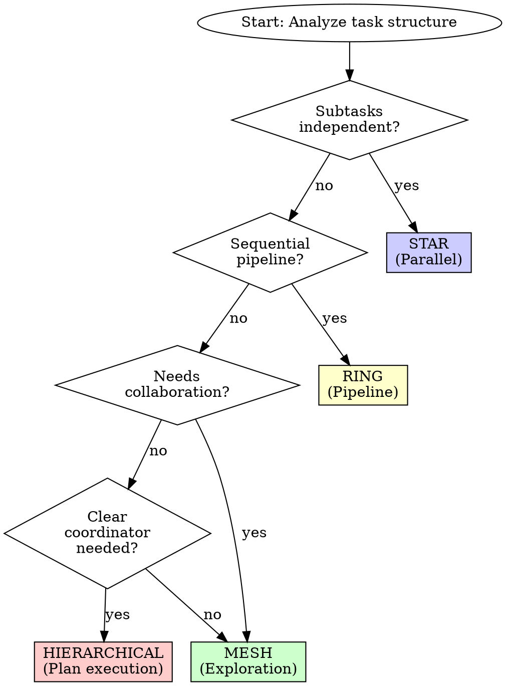

# Swarm Coordination

## Overview

**LEGION** — *A legion is a large, coordinated force organized into precise, independent units.*
When invoked: selects the optimal agent topology for the task — parallel (independent tasks), pipeline (sequential stages), hierarchical (orchestrator + specialists), or mesh (peer review) — and coordinates execution across all agents.


**Core principle:** Match agent topology to task structure — the right coordination pattern prevents chaos and maximizes parallelism.

This skill adds **swarm coordination topologies** to Superpowers. Choose the right agent organization for each task.

**Announce at start:** "Running LEGION to select agent topology and coordinate."

## 4 Swarm Topologies

```
┌─────────────────────────────────────────────────────────────┐
│  HIERARCHICAL (Queen-led)                                   │
│                                                             │
│         ┌─────────────┐                                     │
│         │ Coordinator │                                     │
│         └──────┬──────┘                                     │
│       ┌────────┼────────┐                                   │
│       ▼        ▼        ▼                                   │
│   ┌─────┐  ┌─────┐  ┌─────┐                                │
│   │ W1  │  │ W2  │  │ W3  │                                │
│   └─────┘  └─────┘  └─────┘                                │
│                                                             │
│  Best for: Plan execution, structured tasks                 │
│  Use: subagent-driven-development default                   │
├─────────────────────────────────────────────────────────────┤
│  MESH (Peer-to-peer)                                        │
│                                                             │
│    ┌─────┐    ┌─────┐                                       │
│    │ A1  │────│ A2  │                                       │
│    └──┬──┘    └──┬──┘                                       │
│       │ \      / │                                          │
│       │  \    /  │                                          │
│    ┌──┴───\  /───┴──┐                                       │
│    │ A3  │──│ A4   │                                       │
│    └─────┘  └──────┘                                        │
│                                                             │
│  Best for: Exploration, research, collaborative design      │
│  Use: codebase exploration, bug investigation               │
├─────────────────────────────────────────────────────────────┤
│  RING (Pipeline)                                            │
│                                                             │
│    ┌─────┐    ┌─────┐    ┌─────┐    ┌─────┐                │
│    │ A1  │───▶│ A2  │───▶│ A3  │───▶│ A4  │                │
│    └─────┘    └─────┘    └─────┘    └─────┘                │
│                                                             │
│  Best for: Sequential processing, transformations           │
│  Use: Data pipelines, multi-stage refactors                 │
├─────────────────────────────────────────────────────────────┤
│  STAR (Hub-and-spoke)                                       │
│                                                             │
│              ┌─────┐                                        │
│              │ Hub │                                        │
│              └──┬──┘                                        │
│         ┌───────┼───────┐                                   │
│      ┌──┴──┐ ┌──┴──┐ ┌──┴──┐                               │
│      │ S1  │ │ S2  │ │ S3  │                               │
│      └─────┘ └─────┘ └─────┘                               │
│                                                             │
│  Best for: Independent parallel work                        │
│  Use: Parallel feature development, batch processing        │
└─────────────────────────────────────────────────────────────┘
```

## Topology Selection Decision Tree



## Topology 1: Hierarchical (Queen-led)

**Structure:**
- 1 coordinator (queen) + N workers
- Coordinator assigns tasks, reviews output
- Workers report to coordinator
- Clear chain of command

**Best for:**
- Executing written implementation plans
- Multi-feature development with clear requirements
- Tasks with defined sub-components

**When to use:**
```
✓ Have implementation plan with distinct tasks
✓ Building features with clear component boundaries
✓ Need accountability (who did what)
✓ Tasks have different complexity levels
```

**When NOT to use:**
```
✗ Exploratory work (requirements unclear)
✗ Research tasks (no predefined structure)
✗ Highly collaborative design (all agents equal)
```

**Example: Hierarchical Swarm for Feature Implementation**

```bash
# Coordinator (Queen)
Agent: coordinator
Role: Track task progress, review each subagent output
Tasks: All 5 tasks from implementation plan

# Workers (Spokes)
Agent: backend-coder    → Task 1: API endpoints
Agent: frontend-coder   → Task 2: UI components
Agent: tester           → Task 3: Integration tests
Agent: documenter       → Task 4: API documentation

# Coordination flow
coordinator → assigns task → worker
worker → completes → coordinator reviews
coordinator → approves or requests fix → worker
```

**Prompt template:**
```
SWARM TOPOLOGY: Hierarchical

COORDINATOR AGENT:
You are the queen-coordinator for this implementation.
- Assign tasks to workers in order
- Review each worker's output against spec
- Request fixes if output doesn't match requirements
- Track overall progress
- Report status after each task completes

WORKER AGENTS:
Each worker receives one task with full context.
- Complete the task using TDD
- Self-review before reporting done
- Fix issues when coordinator requests
- Report: DONE, DONE_WITH_CONCERNS, NEEDS_CONTEXT, or BLOCKED

TASKS:
<Task list from implementation plan>
```

---

## Topology 2: Mesh (Peer-to-peer)

**Structure:**
- All agents equal
- Each explores different angle
- Synthesize findings collectively
- No central coordinator

**Best for:**
- Codebase exploration (find all usages)
- Bug investigation (multiple hypotheses)
- Research tasks (gather diverse perspectives)
- Design brainstorming (collaborative ideation)

**When to use:**
```
✓ No clear structure yet (exploration needed)
✓ Multiple independent hypotheses to test
✓ Need diverse perspectives on same problem
✓ Collaborative design session
```

**When NOT to use:**
```
✗ Implementation work (needs coordination)
✗ Clear task breakdown exists
✗ Sequential dependencies between subtasks
```

**Example: Mesh Swarm for Bug Investigation**

```bash
# All agents investigate same bug from different angles
Agent: logs-analyst    → Examine error logs, find patterns
Agent: code-tracer     → Trace data flow through call stack
Agent: recent-changes  → Check git blame, recent commits
Agent: env-checker     → Verify environment/config differences

# Synthesis
All agents → share findings → collective diagnosis
```

**Prompt template:**
```
SWARM TOPOLOGY: Mesh

ALL AGENTS:
You are one of N equal investigators.
- Explore your assigned angle completely
- Share findings with other agents
- Build on other agents' discoveries
- No coordination needed — work in parallel

SYNTHESIS:
After all agents report, combine findings into unified diagnosis.

INVESTIGATION ANGLES:
Agent 1: <angle 1 — e.g., "Examine error logs for patterns">
Agent 2: <angle 2 — e.g., "Trace data flow from input to error">
Agent 3: <angle 3 — e.g., "Check recent commits for related changes">
Agent 4: <angle 4 — e.g., "Compare prod vs staging configuration">
```

---

## Topology 3: Ring (Pipeline)

**Structure:**
- Agents arranged in sequence
- Each agent transforms output of previous
- Output flows: A1 → A2 → A3 → A4

**Best for:**
- Data processing pipelines
- Multi-stage refactors (parse → transform → emit)
- Content generation (outline → draft → review → polish)
- ETL workflows

**When to use:**
```
✓ Clear sequential stages
✓ Each stage transforms previous output
✓ Pipeline stages independent (can debug individually)
```

**When NOT to use:**
```
✗ Parallel work possible (use Star)
✗ Iterative refinement needed (use Hierarchical)
✗ No clear stage boundaries
```

**Example: Ring Swarm for Content Generation**

```bash
# Pipeline: Research → Outline → Draft → Review → Polish

Agent 1 (Researcher): Gather requirements, examples, constraints
  ↓ output: Research summary

Agent 2 (Outliner): Create structure from research
  ↓ output: Detailed outline

Agent 3 (Writer): Write first draft from outline
  ↓ output: Complete draft

Agent 4 (Reviewer): Technical review for accuracy
  ↓ output: Annotated draft with fixes

Agent 5 (Polisher): Final polish, formatting, consistency
  ↓ output: Final document
```

**Prompt template:**
```
SWARM TOPOLOGY: Ring (Pipeline)

PIPELINE STAGES:
Stage 1: <name> — <transformation>
Stage 2: <name> — <transformation>
Stage 3: <name> — <transformation>

RULES:
- Each agent receives output of previous stage
- Each agent adds transformation, passes to next
- If stage fails, notify pipeline coordinator
- Final agent produces pipeline output

INPUT:
<Initial input for Stage 1>

EXPECTED OUTPUT:
<Final output after last stage>
```

---

## Topology 4: Star (Hub-and-spoke)

**Structure:**
- Central hub coordinates
- Spokes work completely independently
- No spoke-to-spoke communication needed

**Best for:**
- Parallel feature development (independent features)
- Batch processing (same operation on many inputs)
- Multi-language localization (same content → N languages)
- Parallel test suites (independent test files)

**When to use:**
```
✓ All subtasks independent (no dependencies)
✓ Same operation repeated on different inputs
✓ No cross-spoke coordination needed
```

**When NOT to use:**
```
✗ Subtasks have dependencies (use Hierarchical)
✗ Spokes need to collaborate (use Mesh)
✗ Sequential processing (use Ring)
```

**Example: Star Swarm for Parallel Features**

```bash
# Hub: Track progress, merge results
Hub: coordinator

# Spokes: Independent features
Spoke 1: Add user profile page
Spoke 2: Add settings page
Spoke 3: Add dashboard widget
Spoke 4: Add notification system

# No dependencies between spokes
# Each spoke can complete independently
```

**Prompt template:**
```
SWARM TOPOLOGY: Star (Hub-and-spoke)

HUB AGENT:
- Assign independent tasks to spokes
- Track completion status
- Merge results when all complete
- No coordination between spokes needed

SPOKE AGENTS:
- Complete your assigned task independently
- No need to communicate with other spokes
- Report directly to hub when done

INDEPENDENT TASKS:
Spoke 1: <task 1>
Spoke 2: <task 2>
Spoke 3: <task 3>
Spoke 4: <task 4>
```

---

## Hybrid: Hierarchical-Mesh (Adaptive)

**Structure:**
- Hierarchical for execution phases
- Mesh for exploration/investigation phases
- Dynamically switch based on current need

**Best for:**
- Complex projects with both exploration and execution
- Projects where requirements emerge during work

**Example: Adaptive Swarm for New Feature**

```
PHASE 1: Exploration (Mesh)
- All agents explore different angles
- Synthesize findings into requirements

PHASE 2: Planning (Hierarchical, coordinator leads)
- Coordinator writes implementation plan
- Decompose into tasks

PHASE 3: Execution (Hierarchical)
- Workers execute assigned tasks
- Coordinator reviews each

PHASE 4: Integration (Mesh)
- All agents collaborate on integration issues
- Collective debugging
```

---

## Consensus for Disagreement Resolution

**When agents disagree:**

### Majority Consensus (simple cases)
```
3 agents agree on approach A
2 agents agree on approach B
→ Proceed with A, document dissenting opinion
```

### Weighted Consensus (domain-specific)
```
Security decision:
- Security-architect vote: 3x weight
- Other agents: 1x weight
→ Highest weighted score wins

Performance decision:
- Performance-engineer vote: 3x weight
- Other agents: 1x weight
```

### Byzantine Consensus (critical decisions)
```
Requirement: f < n/3 faulty agents
With 4 agents: tolerate 1 faulty opinion
With 7 agents: tolerate 2 faulty opinions

Process:
1. Each agent proposes approach
2. All agents vote on proposals
3. Select proposal with >2n/3 votes
4. If no majority, escalate to human
```

---

## Swarm Size Guidelines

| Task Complexity | Swarm Size | Topology |
|-----------------|------------|----------|
| Single file edit | 1 agent | N/A (no swarm) |
| 2-5 files | 2-3 agents | Hierarchical |
| 5-10 files | 3-5 agents | Hierarchical or Star |
| Multi-module | 5-7 agents | Hierarchical-Mesh |
| System-wide | 7-15 agents | Adaptive with phases |

**Diminishing returns:**
- >10 agents: Coordination overhead exceeds parallelism benefit
- >15 agents: Consider decomposing into separate projects

---

## Integration with Existing Skills

**Works with:**

| Skill | Integration |
|-------|-------------|
| `phantom` | Use Hierarchical topology by default |
| `architect` | Use Mesh topology for exploration phase |
| `hunter` | Use Mesh topology for multi-angle investigation |
| `blueprint` | Plan should specify recommended topology |
| `tribunal` | Use Star topology for parallel file review |

---

## Performance Benchmarks

**Expected speedup vs. sequential:**

| Topology | Parallelism | Speedup (ideal) | Speedup (real) |
|----------|-------------|-----------------|----------------|
| Hierarchical | Moderate | 2-3x | 1.5-2x |
| Mesh | High | 4-5x | 2-3x |
| Ring | Low (sequential) | 1x | 0.8x (overhead) |
| Star | Very High | 5-8x | 3-5x |

**Overhead costs:**
- Coordinator assignment: +30 seconds
- Context distribution: +10 seconds per agent
- Synthesis: +1 minute per 5 agents

---

## Swarm Auto-Triggering

**When to automatically invoke a swarm without being asked:**

```
TRIGGER swarm when ALL of:
1. Task touches 3+ independent files
2. No sequential dependency between the changes
3. Total estimated work > 20 minutes single-threaded

AUTO-TRIGGER signals:
- "implement [feature]" across multiple modules
- "refactor [area]" touching > 3 files
- "add tests for [module]" (test files independent)
- "migrate [pattern] across codebase"
- "add [capability] to each [component]"

DO NOT AUTO-TRIGGER:
- Bug fixes (investigation first, sequential)
- Any task < 3 files
- Tasks with shared state changes (schema changes, config changes)
```

**Auto-trigger announcement:**
```
DETECTING: This task touches 5 independent files with no cross-dependencies.
AUTO-TRIGGERING: Star topology swarm (5 spokes, independent execution)
Topology rationale: [reason]
Proceeding...
```

---

## Red Flags

**Never:**
- Use Ring when tasks are independent (waste of parallelism)
- Use Mesh for implementation (no coordination = chaos)
- Use Hierarchical for exploration (coordinator bottlenecks creativity)
- Use Star when subtasks have dependencies (integration fails)
- Deploy >10 agents without clear coordination plan

**Always:**
- Match topology to task structure
- Declare topology before spawning agents
- Assign coordinator for Hierarchical/Star
- Plan synthesis step for Mesh
- Use sequential stages for Ring

---

## Example: Complete Swarm Workflow

```
TASK: Build user authentication system

STEP 1: Select topology
Analysis:
- Have clear requirements (not exploration)
- Multiple independent components (API, UI, tests)
- Clear coordinator needed for review
Decision: Hierarchical

STEP 2: Define agents
Coordinator: Review all output against spec
Worker 1: JWT token service
Worker 2: Auth middleware
Worker 3: Login/logout endpoints
Worker 4: Frontend auth components
Worker 5: Integration tests

STEP 3: Spawn agents
[Spawn 5 agents in parallel with full context]

STEP 4: Coordinate execution
Coordinator assigns Task 1 → Worker 1
Worker 1 completes → Coordinator reviews
Coordinator approves → Assign Task 2 → Worker 2
... continue until all tasks complete

STEP 5: Synthesis
Coordinator verifies all components integrate
Request final code review
Mark swarm complete
```

---

## Final Rule

```
Topology determines success
Match structure to task
Hierarchical for execution
Mesh for exploration
Ring for pipelines
Star for parallel work
```
