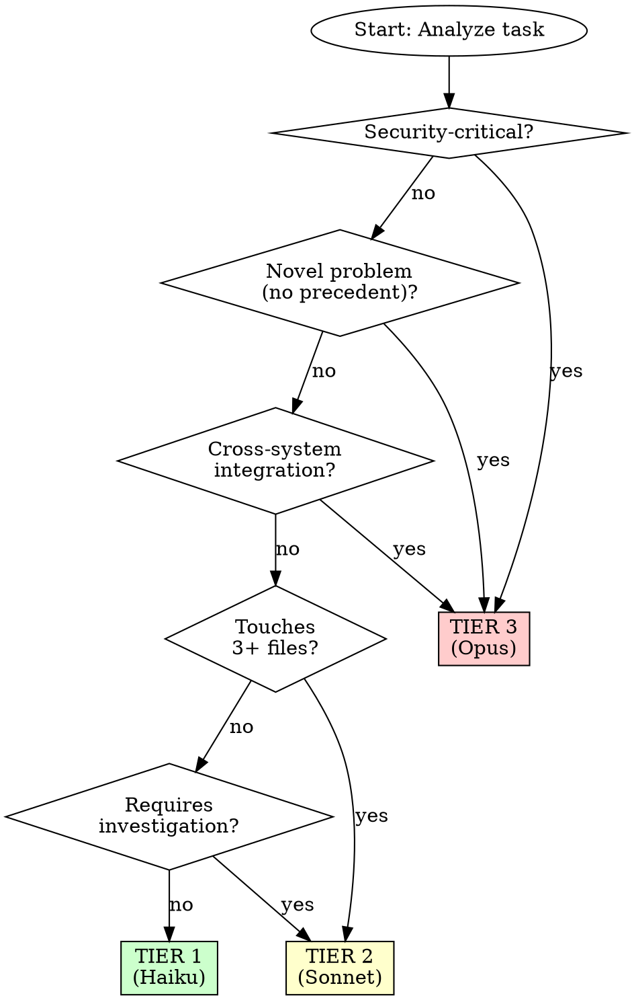

# Model Routing

## Overview

**VECTOR** — *A vector has both direction and magnitude — it points precisely at the right target.*
When invoked: evaluates task complexity and routes to the least-capable model that can succeed — Tier 0 (no LLM) through Tier 3 (Opus). Systematic routing cuts API costs 50–65% vs treating everything as Opus.


**Core principle:** Use the least capable model that can handle the task — save cost and latency without sacrificing quality.

This skill adds **intelligent model selection** to Superpowers. Route tasks to the appropriate tier based on complexity.

**Announce at start:** "Running VECTOR to assign the correct model tier."

---

## Single-Session vs Subagent Context

**Important:** In a standard Claude Code session, you run one model for the entire conversation.
Tier routing applies differently depending on context:

| Context | How VECTOR applies |
|---------|-------------------|
| **Main session** | Tier selection is advisory — it informs how much reasoning depth to apply, not which model to invoke |
| **Spawning subagents** (via COMMANDER or PHANTOM) | Tier selection is literal — specify the model when dispatching: Haiku for Tier 1, Sonnet for Tier 2, Opus for Tier 3 |
| **Multi-agent swarms** (via LEGION) | Assign each agent a tier based on its sub-task complexity |

**When VECTOR delivers full cost savings:** subagent dispatch. Assigning Haiku to mechanical tasks and Opus only to critical reasoning tasks is where the 50–65% cost reduction is realized.

**When VECTOR informs depth:** in your main session, use the tier score to decide how thorough to be — Tier 1 = quick answer, Tier 3 = full investigation + multi-step plan.

## 3-Tier Model Hierarchy

```
┌─────────────────────────────────────────────────────────────┐
│  TIER 3: MOST CAPABLE (Opus 4.6 / equivalent)               │
│  - Architecture decisions                                   │
│  - Security-critical code                                   │
│  - Cross-system integration                                 │
│  - Novel problem-solving                                    │
│  - Review of Tier 2 work                                    │
│  - Cost: $$$ | Latency: High                                │
├─────────────────────────────────────────────────────────────┤
│  TIER 2: STANDARD (Sonnet 4.6 / equivalent)                 │
│  - Multi-file features                                      │
│  - Bug fixes requiring investigation                        │
│  - API integration                                          │
│  - Test design for complex behavior                         │
│  - Cost: $$ | Latency: Medium                               │
├─────────────────────────────────────────────────────────────┤
│  TIER 1: FAST/CHEAP (Haiku 4.5 / equivalent)                │
│  - Single file edits                                        │
│  - Simple refactors (rename, extract)                       │
│  - Test writing for obvious behavior                        │
│  - Documentation updates                                    │
│  - Cost: $ | Latency: Low                                   │
└─────────────────────────────────────────────────────────────┘
```

## Model Selection Decision Tree



## Tier 1: Fast/Cheap (Haiku)

**Use for:**

| Task Type | Examples |
|-----------|----------|
| **Single file edits** | Fix typo, rename variable, add comment |
| **Simple refactors** | Extract function, inline variable, convert loop to comprehension |
| **Mechanical transformations** | Add types, convert var to const, add error handling |
| **Test writing (obvious)** | Test pure function with clear inputs/outputs |
| **Documentation** | Update README, add docstrings |
| **Format fixes** | Fix linting, reformat code |

**Expected performance:**
- Latency: <5 seconds
- Cost: ~$0.0001-0.0005 per task
- Accuracy: >95% for mechanical tasks

**Example prompt for Tier 1:**
```
TASK: Rename function `calculateTotal` to `computeTotal` in src/calculator.ts

INSTRUCTIONS:
- Use project's rename tool or sed
- Update all call sites
- Run tests to verify
- Commit with message: "refactor: rename calculateTotal to computeTotal"

MODEL: Tier 1 (Haiku) — mechanical rename
```

## Tier 2: Standard (Sonnet)

**Use for:**

| Task Type | Examples |
|-----------|----------|
| **Multi-file features** | Add API endpoint (controller + service + test) |
| **Bug fixes (investigation)** | Debug failing test, trace data flow |
| **API integration** | Add Stripe payments, integrate SendGrid |
| **Test design (complex)** | Integration tests, mocking external services |
| **Refactoring (module-level)** | Split large file, reorganize imports |
| **Code review** | Review PR for correctness and style |

**Expected performance:**
- Latency: 10-30 seconds
- Cost: ~$0.002-0.008 per task
- Accuracy: >90% for standard development tasks

**Example prompt for Tier 2:**
```
TASK: Add user authentication to API

REQUIREMENTS:
- JWT-based authentication
- Middleware for protected routes
- Refresh token rotation
- Rate limiting on login

FILES TO TOUCH:
- src/auth/jwt.ts (new)
- src/middleware/auth.ts (new)
- src/routes/users.ts (modify)
- tests/auth.test.ts (new)

MODEL: Tier 2 (Sonnet) — multi-file feature with security considerations
NOTE: Security-critical → consider Tier 3 for review
```

## Tier 3: Most Capable (Opus)

**Use for:**

| Task Type | Examples |
|-----------|----------|
| **Architecture decisions** | Design microservices, choose database, plan migration |
| **Security-critical code** | Auth systems, crypto, payment processing |
| **Cross-system integration** | Distributed transactions, event sourcing |
| **Novel problem-solving** | No StackOverflow, no prior art in codebase |
| **Debugging (elusive)** | Bug survived 3+ fix attempts |
| **Review of Tier 2/3 work** | Final review before merge to main |

**Expected performance:**
- Latency: 30-90 seconds
- Cost: ~$0.01-0.05 per task
- Accuracy: >95% for complex reasoning tasks

**Example prompt for Tier 3:**
```
TASK: Design authentication architecture for multi-tenant SaaS

CONTEXT:
- 10,000+ expected users
- Multiple tenant organizations
- SSO requirements (SAML, OIDC)
- API rate limiting per tenant
- Audit logging requirements

DELIVERABLE:
- Architecture diagram
- Data model for users/tenants
- Auth flow (login, token refresh, logout)
- Security considerations
- Migration plan from current system

MODEL: Tier 3 (Opus) — architecture decision with security implications
```

## Dynamic Model Switching

**Escalate mid-task when:**

| Trigger | Action |
|---------|--------|
| Tier 1 gets stuck | Escalate to Tier 2 |
| Tier 2 encounters novel problem | Escalate to Tier 3 |
| Security implications discovered | Escalate to Tier 3 |
| Task scope grows (1 file → 5 files) | Escalate to Tier 2 or 3 |

**De-escalate when:**
- Tier 3 completes architecture → Tier 2 for implementation
- Tier 2 completes design → Tier 1 for mechanical edits

**Example escalation:**
```
[Tier 1: Haiku] Attempting to fix bug...
STATUS: BLOCKED — Fix didn't work, test still fails

[Controller] Escalating to Tier 2 — requires investigation

[Tier 2: Sonnet] Analyzing root cause...
STATUS: Found root cause — race condition in async code
IMPLEMENTING: Add proper await and error handling

[Tests pass] → Task complete
```

## Model-Specific Prompt Engineering

### Tier 1 (Haiku) — Direct and Mechanical

```
TASK: <specific action>
FILE: <path>
CHANGE: <exact change>

Do exactly this. No design decisions needed.
```

### Tier 2 (Sonnet) — Context-Rich

```
TASK: <feature/bug>
CONTEXT: <why this matters>
REQUIREMENTS:
- <requirement 1>
- <requirement 2>

FILES:
- Create: <paths>
- Modify: <paths>

CONSTRAINTS:
- <performance requirements>
- <compatibility requirements>

APPROACH:
<Suggested approach or reference to similar code>
```

### Tier 3 (Opus) — Open-Ended Reasoning

```
PROBLEM: <complex challenge>
CONTEXT: <background, constraints, stakeholders>

CURRENT STATE:
<What exists now>

DESIRED STATE:
<What we want>

UNKNOWNS:
<What we don't know yet>

PLEASE:
- Analyze trade-offs
- Propose 2-3 approaches
- Recommend one with reasoning
- Identify risks and mitigations
```

## Cost Optimization

**Expected savings with routing:**

| Scenario | Without Routing | With Routing | Savings |
|----------|-----------------|--------------|---------|
| 10 Tier 1 tasks | All Opus ($0.50) | All Haiku ($0.05) | 90% |
| Mixed workload | All Sonnet ($1.00) | 60% Haiku, 30% Sonnet, 10% Opus | 50-60% |
| Complex project | All Opus ($5.00) | Right-sized per task | 30-40% |

**Monthly cost projection (1000 tasks/day):**

| Strategy | Daily Cost | Monthly Cost |
|----------|------------|--------------|
| All Opus | $50 | $1,500 |
| All Sonnet | $20 | $600 |
| **With Routing** | **$8-12** | **$240-360** |

## Integration with Subagents

**When dispatching subagents, specify model tier:**

```markdown
### Task 3: Add input validation

**Model:** Tier 2 (Sonnet) — multi-file validation logic

**Instructions:**
<full task description>

**Why Tier 2:**
- Touches 3 files (controller, service, test)
- Requires judgment on error messages
- Not security-critical (handled by auth middleware)
```

**Model selection in subagent-driven-development:**
```
Per-task model selection:
- Mechanical implementation (1-2 files, clear spec) → Tier 1
- Integration tasks (multiple files, coordination) → Tier 2
- Architecture/judgment tasks → Tier 3
```

## Red Flags

**Never:**
- Use Tier 3 for mechanical tasks (waste of money)
- Use Tier 1 for security-critical code (false economy)
- Use Tier 1 for novel problems (will get stuck)
- Stay in Tier 2 after 3 failed attempts (escalate)
- Skip Tier 3 review for architecture decisions

**Always:**
- Start with lowest tier that could handle it
- Escalate when stuck (don't thrash)
- De-escalate after architecture decided
- Track which tier succeeded for future routing

## Routing Feedback Loop

**After EVERY routed task, record outcome in auto-memory:**

Store a one-line routing result in `~/.claude/projects/.../memory/MEMORY.md`:

```markdown
- [Routing: <task-type>](routing_log.md) — Tier N → [Success|Escalated|Failed]
```

And append to `routing_log.md`:
```
| 2026-04-13 | <task-1-line-description> | Tier N | Success/Escalated | <why> |
```

**Routing improvement signals:**

| Pattern | Adjustment |
|---------|-----------|
| Tier 1 escalated to Tier 2 ≥ 3x | Start that task type at Tier 2 |
| Tier 2 escalated to Tier 3 ≥ 2x | That pattern = Tier 3 default |
| Tier 3 completed trivially | Over-routed — note for next time |
| Tier 0 produced wrong output | Mechanical assumption was wrong |

**Weekly review question:** *"Which task types am I consistently misrouting?"*

This turns routing from static heuristics into an improving system.

## Model Capabilities Reference

| Capability | Haiku | Sonnet | Opus |
|------------|-------|--------|------|
| Simple edits | ✓ | ✓ | ✓ |
| Test writing (basic) | ✓ | ✓ | ✓ |
| Multi-file features | ✗ | ✓ | ✓ |
| Bug investigation | ✗ | ✓ | ✓ |
| Architecture design | ✗ | △ | ✓ |
| Security analysis | ✗ | △ | ✓ |
| Novel problem-solving | ✗ | △ | ✓ |
| Code review | ✗ | △ | ✓ |

✓ = Strong | △ = Adequate | ✗ = Not recommended

## Tier 0: Agent Booster (Zero-LLM Path)

**The fastest and cheapest tier — skip the LLM entirely.**

Some transforms are so mechanical they don't need language model reasoning. Execute them directly with deterministic code or sed/awk patterns.

**Use Tier 0 for:**

| Transform | Example |
|-----------|---------|
| `var` → `const`/`let` | `sed -i 's/\bvar /const /g' file.ts` |
| Add type annotations | Regex-based type insertion on known patterns |
| Sort imports | `import-sort` or `eslint --fix` |
| Rename single identifier | `sed -i 's/\boldName\b/newName/g'` |
| Format/lint | `prettier --write`, `eslint --fix`, `black` |
| Add `console.log` statements | Direct string insert at known line |
| Remove dead code comments | Regex strip `// TODO:` lines |

**Characteristics:**
- Latency: <1ms (no API call)
- Cost: $0
- Accuracy: 100% for exact pattern matches
- Scope: single file, single pattern, no judgment needed

**Tier 0 gate — ALL must be true:**
1. Transform is mechanical (no judgment, no context needed)
2. Pattern is unambiguous (one exact match)
3. Single file
4. Reversible (git rollback easy)

**If Tier 0 fails (unexpected match, multi-file, etc.) → escalate to Tier 1.**

---

## Final Rule

```
Tier 0 (direct): mechanical single-pattern transforms — $0
Tier 1 (Haiku):  single file, obvious behavior — cheap/fast
Tier 2 (Sonnet): multi-file, investigation — standard
Tier 3 (Opus):   architecture, security, novel — capable

Default to lowest tier that can handle it
Escalate when stuck, de-escalate after hard parts resolved
Track routing for learning
```
